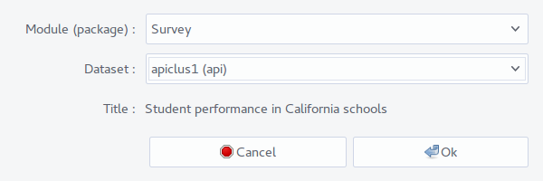
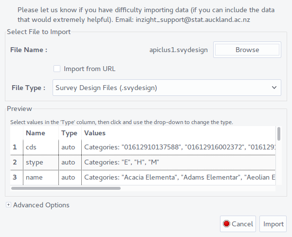

```{r, include = FALSE}
knitr::opts_chunk$set(
  collapse = TRUE,
  comment = "#>"
)
```

Analysing survey data is a core focus of iNZight, as analysis of survey data is not so different from an IID sample---once you have figured out the survey design. iNZight now offers three ways of passing survey design information into iNZight, two of which make use of a (new) survey specification (based heavily on `survey::svydesign()`).

For this demonstration, we will be using the well known `apiclus1` dataset that comes with the 'survey' package. If you're following along with iNZight, you can load the data for methods 1 and 2 from **File** > **Example data**, choosing 'survey' package, and `apiclus1` for the data:

<center>

</center>

### Method 1: specifying survey design from the GUI

The obvious place to specify the design is from the **Dataset** > **Survey**, which displays a set of inputs for users to select which variables are which in the survey design. Here's what the `apiclus1` specification should look like:

<center>

</center>

It might not look like much has happened, but iNZight will now use the survey design in all operations---plots, summaries, even regression modelling! Try it out: make a graph of `api00` and notice that in place of iNZight's usual *dot plot*, you get a *histogram* instead. And if you've enabled the *code panel*, you'll see that the call to `inzplot()` is using the `design` argument (instead of `data`).

<center>
{width=100%}
</center>

You may also obtain a numerical summary of `api00` by clicking on the **Get Summary** button. This will display information about the variable as well as the design specification of the data. The numeric summaries are estimates of the **population values**, and so---unlike standard data---have associated standard errors displayed underneath (i.e., the median `api00` of the population is etimated to be 652 with a standard error of 36.56).

<center>
{width=80%}
</center>


### Method 2: the 'survey specification' format

You may have noticed the 'Read from file' button in the survey specification window. This is an alternative method of setting the specification, which is particularly useful if you aren't familiar with the survey design (and it saves you from having to look it up each time and, likely, making a mistake!). This file uses `TOML` format, which is machine- and human-readable, and specifies the variables using syntax closely resembling arguments to the `survey::svydesign()` function. Here's what the file looks like for the `apiclus1` data:
```
# apiclus1.svydesign
type = "survey"
ids = "dnum"
weights = "pw"
fpc = "fpc"
```
This should be given a `.svydesign` extension. After clicking the **Read from file** button, browse for the file and load it. Again, nothing will happen (especially if you didn't remove the previous design first!), but in the background iNZight has parsed the file (using the helper function `iNZightTools::import_survey`, see end of Vignette for R usage) and is now using the design.


### Method 3: one-step survey loading

In a typical scenario, researchers would provide a data file containing the survey data (a `.csv`, perhaps), and with this they might also need to provide a `.svydesign` specification file. To make importing survey data *even easier*, the survey specification accepts another argument: a file path. If you're following along, you'll first need to save the `apiclus1` data into the same folder as the `apiclus1.svydesign` file from method 2, which can be done from **File** > **Export data**, clicking 'open' to browse for the save location, and specifying CSV for the file type. Now edit the specification file by adding an extra line:
```
# apiclus1.svydesign
data = "apiclus1.csv"  # this should be whatever you called the file when you saved it
type = "survey"
ids = "dnum"
weights = "pw"
fpc = "fpc"
```

Now you can close iNZight and start it up again. Now, instead of loading the example data, or even the data, we're just going to load the survey specification file by going to **File** > **Import data** and browsing for the `apiclus1.svydesign` file:

<center>

</center>

Now, just like that, you've loaded a complex survey data set *with the design information already attached*!! Go ahead and make some graphs, produce summaries, perform some simple hypothesis tests (from the **Get Inference** button) and, if you're feeling adventurous, fit some regression models (**Advanced** > **Model Fitting**).


## Other specification options

iNZight knows how to handle stratified and/or clustered survey designs (i.e., what you'd load using `survey::svydesign()`), and replicate designs (`survey::svrepdesign()`), and can also handle post stratification or calibration. Again, there are UI windows to do all of this, but since we're here to talk about the specification format, here's what those look like.

### Standard surveys

```
data = "path/to/data.csv"  # either relative to the specification file, or absolute
ids = 1                    # default 1; or "clus"; or "clus1 + clus2"
strata = "stratvar"        # the stratification variable
weights = "wts"            # the weighting variable
fpc = "fpc"                # any finite population correction variable(s)
nest = false               # or true
```

### Replicate designs

Replicate designs use different arguments, and most importantly specify the columns containing the replicate weights, and some other details. The replicate weights can either be a *vector* of names, or a regular expression (which is preferred as it is easier that typing out 20, 30, or 80 variable names!).

```
data = "path/to/data.csv"
weights = "wt0"            # the main weighting variable
repweights = "^w[0-2]"     # this will match any variables starting with a `w`
                           # followed by a 0, 1, or a 2 and then anything
                           # (e.g., w01, w14,and w20, but not w30)
reptype = "other"          # the method used to generate the replicate weights
                           # (e.g., "JK1", "BRR", etc)
scale = 1                  # scaling constant for variance
rscales = 1                # either a single number if same for all replicate weights,
                           # or a vector for each replicate weight:
                           # rscales = [2, 0.45, ...]
```

### Calibration

If available, this information can be automatically included in the survey by passing additional lines to the specification file. This uses some TOML-specific syntax, but should be fairly straightforward (it's also the reason we needed to use TOML and not something simpler). In this example, we calibrate using `stype` and `sch.wide` by passing in the *raw* population values (behind the scenes iNZight formats these correctly):

```
# apical.svydesign
data = "apiclus1.csv"
type = "survey"
ids = "dnum"
weights = "pw"
fpc = "fpc"

[calibrate.stype]
E = 4421
H = 755
M = 1018

[calibrate."sch.wide"]    # we must include quotes around variable names containing dots
No = 1072
Yes = 5122
```


## For R nerds: The survey specification object

The magic all happens in the 'iNZightTools' package, which has a handy 'import_survey' function.

```{r import_demo}
library(iNZightTools)
(svy <- import_survey('apiclus1.svydesign'))

summary(survey::svyglm(api00 ~ api99, design = svy$design))


import_survey('apical.svydesign')
```
